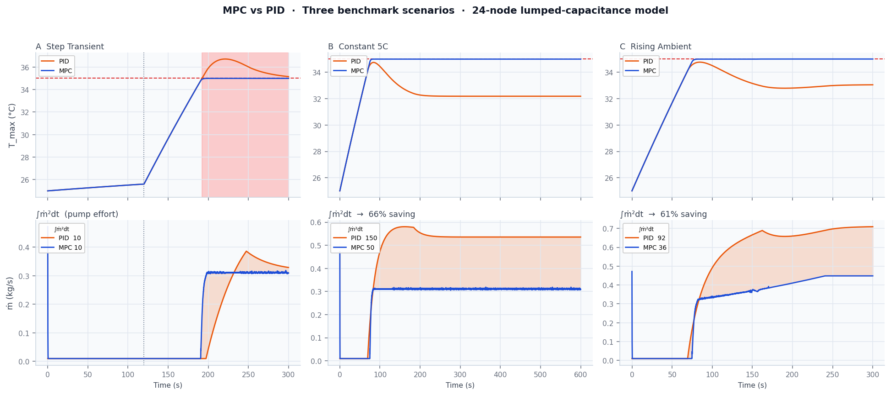
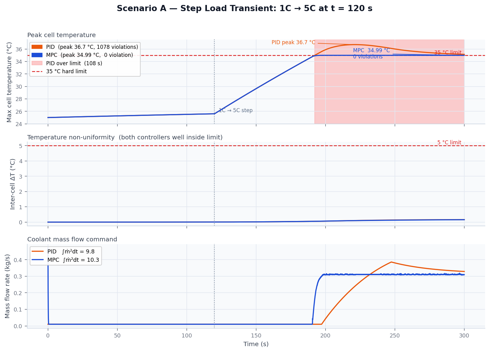
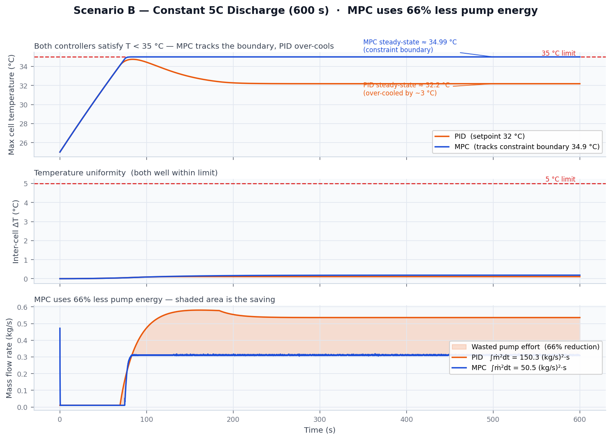
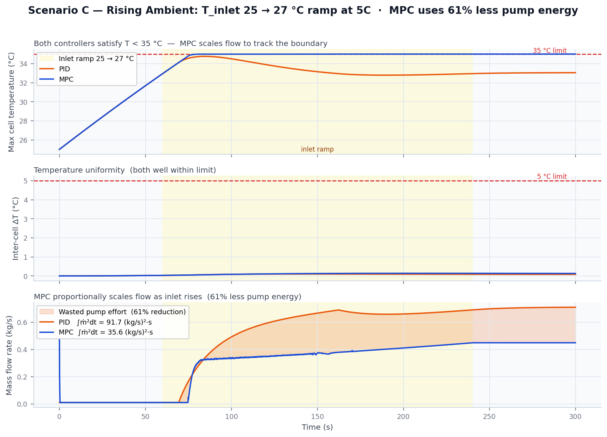

# Battery Thermal MPC

[](https://github.com/afonsocosta90/battery-flow-control/actions/workflows/ci.yml)
[](LICENSE)
[](CMakeLists.txt)
[](https://github.com/afonsocosta90/battery-flow-control/actions/workflows/ci.yml)

**Predictive thermal control for an immersion-cooled 24s13p lithium-ion battery module.**

C++20 simulation comparing Model Predictive Control against PID on a physically-grounded battery
thermal problem. The plant is a 24-node lumped-capacitance model with an algebraic serial coolant
chain. The MPC solver is written from scratch — single-shooting projected gradient descent, no
external QP library.

---

<p align="center">
  
</p>

*Top row: peak cell temperature (red dashed = 35 °C hard limit; shaded region in scenario A = PID
constraint violation). Bottom row: coolant mass flow rate; shaded area = pump energy saved by MPC.*

---

## Results

Three benchmark scenarios quantify two independent advantages of MPC over PID on this topology.

### Scenario A — Step-transient constraint satisfaction

> **1C → 5C load step at t = 120 s. Neither controller receives preview of the step.**

<p align="center">
  
</p>

| Controller | Peak T_cell | Violations | Duration over limit | ∫ṁ² dt |
|:-----------|:-----------:|:----------:|:-------------------:|:------:|
| **MPC**    | **35.0 °C** | **0**      | **0 s**             | 10.3   |
| PID        | 36.7 °C     | 1 078      | 107.8 s             | 9.8    |

The PID controller can only react after temperature has already risen. Due to the serial coolant
asymmetry (cell 24 always sees pre-heated coolant), the downstream cell violates the 35 °C
constraint for 107.8 s before the integrator recovers. MPC rolls the thermal dynamics forward
over a 2-second horizon, sees the impending violation, and pre-empts it — even without any
preview of the upcoming step.

---

### Scenario B — Pump energy efficiency at sustained 5C discharge

> **Constant 5C, 600 s. Both controllers satisfy all constraints.**

<p align="center">
  
</p>

| Controller | Peak T_cell | Violations | ∫ṁ² dt       |
|:-----------|:-----------:|:----------:|:------------:|
| **MPC**    | 35.0 °C     | **0**      | **50.5**     |
| PID        | 32.0 °C     | 0          | 150.3        |

**MPC uses 66% less pump energy.** PID tracks a conservative 32 °C setpoint, over-cooling by 3 °C
and running the pump proportionally harder. MPC targets the constraint boundary (34.9 °C) and uses
exactly the flow thermodynamically necessary to stay there.

---

### Scenario C — Rising ambient disturbance rejection

> **T_inlet ramps 25 → 27 °C between t = 60 s and t = 240 s at 5C discharge.**

<p align="center">
  
</p>

| Controller | Peak T_cell | Violations | ∫ṁ² dt   |
|:-----------|:-----------:|:----------:|:--------:|
| **MPC**    | 35.0 °C     | **0**      | **35.6** |
| PID        | 34.8 °C     | 0          | 91.7     |

**MPC uses 61% less pump energy.** MPC proportionally scales flow as the inlet temperature rises,
tracking the constraint boundary throughout. The reactive PID runs the pump at a fixed aggressive
rate regardless of how much margin remains.

---

## Why MPC Outperforms PID Here

The root cause is the **serial coolant asymmetry**. Coolant flows past all 24 series positions in
sequence — it enters cold at position 1 and exits pre-heated at position 24. Cell 24 therefore
always runs hotter than cell 1 under identical electrical load.

```
Coolant → [cell 1] → [cell 2] → … → [cell 24] → outlet
              ↑ coolest                   ↑ hottest
```

A PID controller reacts to the *current* maximum cell temperature. During a rising-load transient,
that maximum is already at the constraint before the controller has acted. By then it is too late.

MPC exploits the model. It rolls the 24-state dynamics forward over a 20-step (2 s) horizon,
predicts when cell 24 will hit 35 °C, and adjusts the *current* flow command to prevent it. On
the constant-5C scenario it also recognises that the current temperature is safely below the
constraint and deliberately reduces flow — PID cannot reason about this trade-off explicitly.

**Any simplification that erases the serial asymmetry (uniform coolant, single lumped node)
destroys the physical argument for MPC. It is deliberately preserved here.**

---

## Architecture

Seven modules in a strict dependency DAG — no cycles, no globals, no singletons:

```
core  ──►  config, model, solver
config, model, solver  ──►  control
config  ──►  scenario
control, model, scenario  ──►  sim
sim  ──►  main
```

| Module | Responsibility |
|:-------|:---------------|
| `core` | Strong physical types (`Temperature`, `MassFlowRate`, `Current`, …). Zero deps. |
| `config` | YAML load + validation. Throws `std::runtime_error` naming the offending field. |
| `model` | **Pure function** `(ThermalState, ṁ, I, T_inlet, dt) → ThermalState`. Owns no state. Shared between live simulation and MPC internal rollouts. |
| `solver` | `GradientDescentSolver` — central finite-difference gradients, box projection, warm-start by sequence shift. |
| `control` | C++20 `Controller` concept + `PidController` + `MpcController`. The only stateful layer. |
| `scenario` | Three discharge profiles returned as `std::function` closures. |
| `sim` | `Simulator<Controller>` — templated time-stepping harness + CSV logger. Zero virtual calls. |

**Key design choices:**

- `Controller` is a **C++20 concept**, not a base class. Zero virtual calls in the simulation loop; controller type is resolved once at startup in `main()`.
- **No-preview policy**: MPC receives only `I_cell` and `T_inlet` at the current step and holds them constant over the horizon. The advantage comes purely from the 2-second predictive horizon.
- **From-scratch solver**: gradient descent over the 20-element input sequence, not OSQP or any QP library. Deliberate engineering trade-off: understandable, auditable, and sufficient for this problem size. QP replacement is the natural next step.

All physical parameters, controller tuning, and scenario definitions live in `config/*.yaml` — the single source of truth. No magic numbers in source.

---

## Tests — 51 Passing

[](https://github.com/afonsocosta90/battery-flow-control/actions/workflows/ci.yml)

The test suite is built and run automatically on every push via GitHub Actions (Ubuntu 22.04, GCC, C++20). **Click the badge above to see the latest run output.**

```bash
# Run locally
cd build && ctest --output-on-failure
```

| Suite | Tests | What it verifies |
|:------|:-----:|:-----------------|
| `ThermalModel` | 15 | Energy conservation (non-negotiable invariant); monotone coolant chain; higher flow → lower temperature; two-node core/can model (T2); Nusselt-correlation convection (T5); physics validation — gradient direction, decay, step-response lead (T7) |
| `SensorModel` | 10 | Perfect / Downstream / Sparse observation modes; observed max matches true max in perfect mode; downstream always returns position 23; sparse never exceeds global max (T1) |
| `PidController` | 10 | Zero-error → minimum flow; integrator saturation; reset; back-calculation anti-windup prevents windup at ṁ_max; deadband suppresses sub-threshold errors; downstream-sensor error tracks cell[23] (T4) |
| `MpcSolver` | 5 | Convergence to known interior optimum; box-constraint projection; warm-start sequence reuse; scalar and vector cost cases |
| `Integration` | 4 | Full PID + MPC end-to-end runs; downstream-sensor PID run; output CSV produced for both controllers |
| `ConfigValidation` | 3 | YAML loading; missing/invalid keys; out-of-range values |
| `CoreTypes` | 4 | Strong-type arithmetic; compile-time unit-safety static assertions |
| **Total** | **51** | |

**Non-negotiable invariants:** `ThermalModel.EnergyConservation` and
`MpcSolver.ConvergesToInteriorMinimum` must never be skipped or weakened. If either fails after
a model or solver change, the change is wrong — not the test.

---

## Quick Start

```bash
# Dependencies (macOS with Homebrew)
brew install cmake yaml-cpp eigen googletest

# Build
mkdir build && cd build
cmake .. -DCMAKE_BUILD_TYPE=Release
cmake --build . -j

# Run tests (51 tests, ~0.4 s)
ctest --output-on-failure

# Run all six scenario × controller combinations
cd ..
./build/btm config/default.yaml                 pid
./build/btm config/default.yaml                 mpc
./build/btm config/scenario_step_transient.yaml pid
./build/btm config/scenario_step_transient.yaml mpc
./build/btm config/scenario_rising_ambient.yaml pid
./build/btm config/scenario_rising_ambient.yaml mpc

# Regenerate the docs/images/ plots (requires pandas + matplotlib)
python3 scripts/make_readme_plots.py

# Generate a self-contained HTML comparison report
python3 scripts/generate_report.py --run   # re-runs simulations, then builds report
# → final_report/report.html
```

**Dependencies**: CMake ≥ 3.20, C++20 compiler (GCC 11+ / Clang 13+), yaml-cpp, Eigen3,
GoogleTest. Python 3 + pandas + matplotlib for plots and report only.

**IDE support**: `compile_commands.json` at the project root is a symlink to
`build/compile_commands.json`. clangd and VS Code IntelliSense find all headers automatically
after the first CMake configure.

---

## Configuration

All parameters live in `config/`. The controller type in the YAML is overridden by the second
command-line argument:

| File | Scenario | Duration |
|:-----|:---------|:--------:|
| `default.yaml` | Constant 5C discharge | 600 s |
| `scenario_step_transient.yaml` | 1C → 5C step at t = 120 s | 300 s |
| `scenario_rising_ambient.yaml` | T_inlet 25 → 27 °C ramp | 300 s |

---

## Documentation

| Document | Contents |
|:---------|:---------|
| [`docs/DESIGN.md`](docs/DESIGN.md) | Authoritative specification: physical model derivation, MPC formulation, solver rationale, validation scenarios, timeline, risks |
| [`docs/ARCHITECTURE.md`](docs/ARCHITECTURE.md) | Physical equations (explicit Euler, successive-substitution coolant chain, convective coefficient), module breakdown, verified results |

---

## Non-Goals

- Not CFD — the 24-node lumped model is the deliberate fidelity ceiling for MPC tractability
- Not production — no RTOS, no safety case, no HIL
- No electrochemical model, no state estimation, no aging
- No external QP solver — gradient descent is the baseline; OSQP is documented future work
