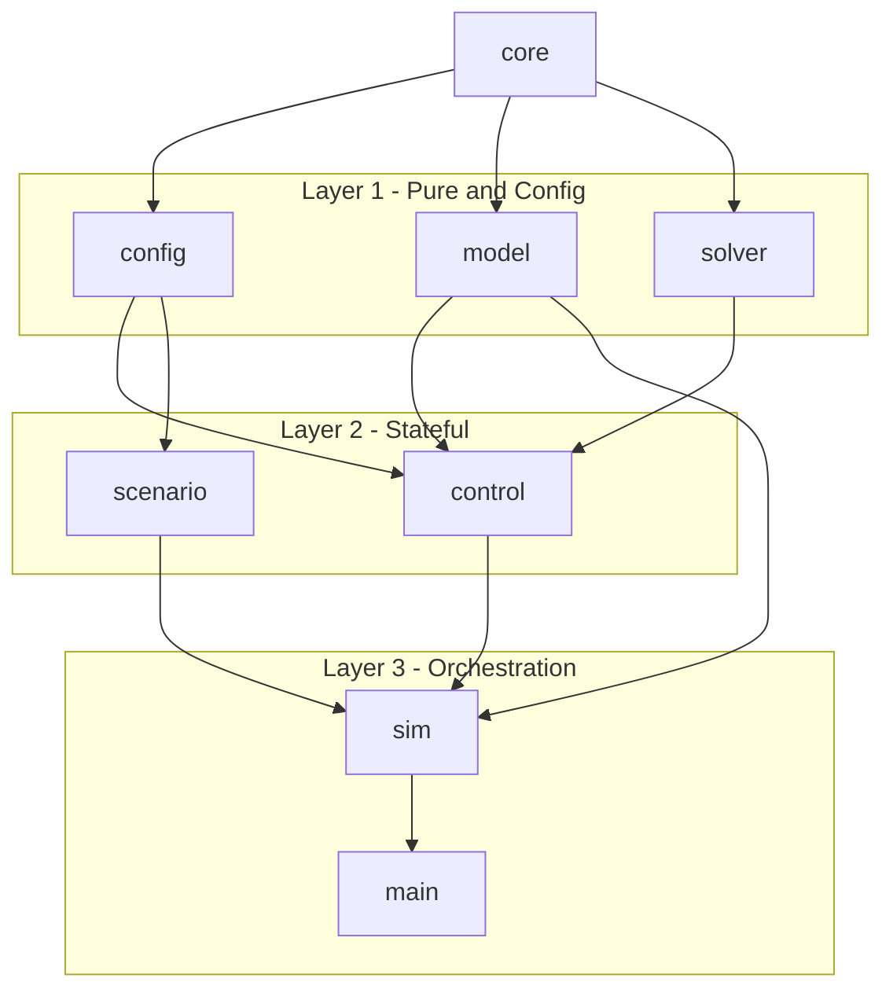
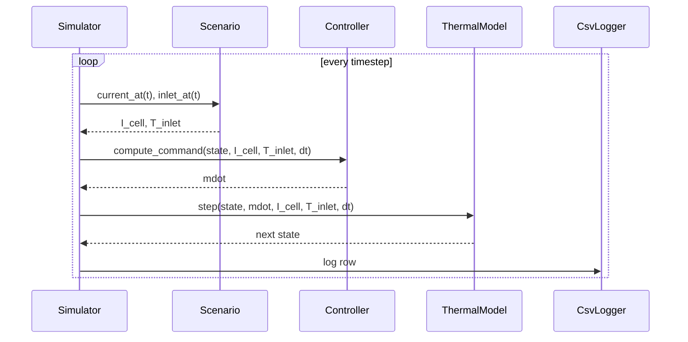

# ARCHITECTURE.md — Battery Thermal MPC

**Architecture, physical model, and implementation reference.**  
Complements [DESIGN.md](DESIGN.md) (full derivation and engineering rationale). Read before any non-trivial change.

---

## 1. Project Goals

### Primary Technical Goal
Demonstrate that a model-predictive controller (MPC), using a from-scratch gradient-descent solver, outperforms a well-tuned PID baseline on a realistic, data-grounded battery thermal management problem.

**Headline result A (step-transient scenario):** Under a sudden 1C → 5C load step, a well-tuned PID violates T_cell ≥ 35 °C for 107.8 s (peak 36.7 °C). MPC holds T_cell < 35 °C for the entire trajectory with zero violations.

**Headline result B (constant 5C scenario):** At sustained 5C discharge with identical constraint satisfaction, MPC achieves **66% lower integrated pump effort** (∫ṁ² dt = 50.5 vs 150.3) — far exceeding the ≥ 10% design target.

**Headline result C (rising ambient scenario):** As T_inlet ramps 25 → 27 °C at 5C, MPC uses **61% less pump energy** (35.6 vs 91.7) with zero violations for both controllers.

### Secondary Goals
- C++20 portfolio piece: concepts, strong physical types, pure functions, YAML single-source-of-truth.
- From-scratch MPC solver (single-shooting gradient descent, no external QP library).
- Strict energy conservation as a non-negotiable invariant test.

### Non-Goals
- Not CFD — the 24-node lumped model is the deliberate fidelity ceiling.
- Not production — no RTOS, no safety case, no HIL.
- No electrochemical model, no state estimation, no aging.
- No QP solver (OSQP etc.) — documented as future work.

---

## 2. Physical Model

### 2.1 Module Topology

The NGS BP9 module is a **24s13p** arrangement of Molicel INR-21700-P45B cells in direct-immersion Shell E5 TM 410 dielectric coolant. The key modelling insight: under immersion, all 13 parallel cells at each series position see identical coolant and carry equal current. They are thermally indistinguishable and collapse to **one effective node per series position**, reducing the state dimension from 312 to 24 with no loss of physical fidelity.

Coolant flows serially along the 24 positions — it enters at position 1 (coolest) and exits at position 24 (hottest). Position 24 therefore always runs hotter than position 1. This asymmetry is the core physical reason MPC beats PID: MPC sees the impending violation at node 24 in its rollout horizon; PID only sees the current temperature error.

### 2.2 State

The simulation state at each timestep is 24 can (surface) temperatures, 24 core temperatures, and 24 coolant temperatures — one per series position:

```
ThermalState = { T_can[0..23],  T_core[0..23],  T_coolant[0..23] }   (all in °C)
```

`T_can` (stored as `cell_temperatures`) is the externally observable surface temperature. `T_core` is the internal jellyroll temperature — the safety-critical maximum. In single-node mode (default), `T_core == T_can` at every position, so all prior results and CI thresholds are unchanged. See §2.4 for the two-node dynamics.

### 2.3 Heat Generation

Ohmic losses only, using the η_IR,1C parameter from a Levenberg-Marquardt fit on the Molicel INR-21700-P45B cell chemistry:

```
Q_cell = η_IR,1C · I_cell² / I_1C                                   (W per cell)
```

- `η_IR,1C = 0.077837 V`  (fitted; captures internal resistance + tab losses)
- `I_1C = 4.5 A`           (1C current = capacity in Ah)
- `I_cell` = per-cell current = I_pack / 13

At 5C: `I_cell = 22.5 A` → `Q_cell = 0.077837 · 22.5² / 4.5 ≈ 8.76 W`  
Total module: `24 · 13 · 8.76 ≈ 2.73 kW`

### 2.4 Cell Thermal Dynamics

Two selectable models, chosen via `cell.model` in YAML.

**Single-node (default — `cell.model: single_node`)**

Each series position i obeys a lumped energy balance (explicit Euler):

```
C_th · dT_cell,i/dt = Q_cell - h(ṁ) · A · (T_cell,i - T_coolant,i)
```

Integrated one step (dt = 0.1 s):

```
T_cell,i(t+dt) = T_cell,i(t) + [Q_cell - h(ṁ)·A·(T_cell,i - T_coolant,i)] · dt / C_th
```

Parameters:
- `C_th = m_cell · cp_cell = 0.070 kg · 900 J/(kg·K) = 63 J/K`
- `A = 0.00475 m²`  (cell surface area, 2πrh + 2πr²)
- `h(ṁ)` = convective coefficient, see §2.6

**Two-node (`cell.model: two_node`)**

Adds a separate jellyroll core node coupled to the can (surface) node through an internal resistance R_core_can. Heat is generated only in the core:

```
C_core · dT_core,i/dt =  Q_cell − (T_core,i − T_can,i) / R_core_can
C_can  · dT_can,i/dt  = (T_core,i − T_can,i) / R_core_can − h·A·(T_can,i − T_coolant,i)
```

where `C_core = (1 − f)·C_th`, `C_can = f·C_th`, `f = 0.10` (10 % of mass in the thin Al can wall). At 5C steady state, the analytical gradient is `Q × R = 8.76 × 0.8 ≈ 7 °C`. The coolant chain couples to the can temperature (the physical contact surface). Safety constraints and MPC cost function enforce on `T_core` (the internal maximum). Default YAML parameters: `r_core_can_k_per_w: 0.8`, `c_can_fraction: 0.10`.

### 2.5 Algebraic Coolant Chain

The coolant temperature at each position is **not a dynamic state** — it is algebraic, determined by the upstream positions and the current flow rate. The energy balance at position i:

```
ṁ · cp,coolant · (T_coolant,i - T_coolant,i-1) = h(ṁ) · A · (T_cell,i - T_coolant,i)
```

Solving for `T_coolant,i`:

```
             T_coolant,i-1  +  (h·A / ṁ·cp) · T_cell,i
T_coolant,i = ──────────────────────────────────────────
                        1  +  h·A / (ṁ·cp)
```

with `T_coolant,0 = T_inlet` (known boundary condition).

This equation is implicit because the right-hand side uses `T_cell,i` which has already been updated by the Euler step, and the chain must be solved sequentially from i=0 to i=23. Three passes of successive substitution are performed to reduce the coolant residual below 0.02 °C (verified by the `ThermalModel.EnergyConservation` test).

**Implementation note:** Phase 1 performs the Euler step for all 24 cell temperatures once. Phase 2 performs the three-pass successive substitution for the coolant chain using the updated cell temperatures from Phase 1. Interleaving the two phases (as in an earlier buggy version) would effectively integrate cell temperatures three times.

### 2.6 Convective Coefficient

Two selectable models, chosen via `convection.model` in YAML.

**Power-law (default — `convection.model: power_law`)**

```
h(ṁ) = h_ref · (ṁ / ṁ_ref)^n
```

- `h_ref = 250 W/(m²·K)` at reference flow `ṁ_ref = 0.5 kg/s`
- Scaling exponent `n = 0.6` (standard forced-convection scaling)

**Nusselt correlation (`convection.model: nusselt_correlation`)**

Derived from first principles using Shell E5 TM 410 fluid properties:

```
Re  = ṁ · D_h / (A_flow · μ)    [Re ≈ 600 at ṁ = 0.5 kg/s → laminar]
Pr  = μ · cp / k                 [Pr ≈ 338 for this dielectric oil]
Nu  = c · Re^m · Pr^n           [Sieder-Tate laminar: c=0.197, m=n=0.333]
h   = Nu · k / D_h               [≈ 250 W/(m²·K) at the calibration point]
```

Both models produce identical h at the reference point (250 W/(m²·K) at 0.5 kg/s) and are monotonically increasing with ṁ — both invariants are enforced in the test suite. All parameters live in `config/` — not in source code.

### 2.7 Physical Parameters (Shell E5 TM 410 + Molicel INR-21700-P45B)

| Parameter | Symbol | Value | Source |
|-----------|--------|-------|--------|
| Cell capacity | `I_1C` | 4.5 Ah | datasheet |
| Cell mass | `m_cell` | 70 g | datasheet |
| Cell specific heat | `cp_cell` | 900 J/(kg·K) | typical Li-ion cylindrical |
| Cell surface area | `A` | 47.5 cm² | geometry (21700: r=10.5mm, h=70mm) |
| Ohmic coefficient | `η_IR,1C` | 0.077837 V | L-M fit on cell data |
| Coolant density | `ρ` | 805 kg/m³ | Shell TDS |
| Coolant specific heat | `cp,cool` | 3500 J/(kg·K) | Shell TDS |
| Coolant viscosity | `μ` | 0.012565 Pa·s | Shell TDS |
| Coolant conductivity | `k` | 0.13 W/(m·K) | Shell TDS |
| Pump range | `ṁ` | 0.01 – 2.0 kg/s | design |
| Max cell temperature | `T_max` | 35 °C | constraint |
| Max inter-cell ΔT | `ΔT_max` | 5 °C | constraint |

---

## 3. Control Strategy

### 3.1 Controller Interface (C++20 Concept)

The simulator is templated on a `Controller` concept — zero virtual functions in the hot path:

```cpp
template <typename C>
concept Controller =
    requires(C& c, const model::ThermalState& s,
             core::Current I_cell, core::Temperature T_inlet, core::Duration dt) {
        { c.compute_command(s, I_cell, T_inlet, dt) } -> std::convertible_to<core::MassFlowRate>;
        { c.reset() } -> std::same_as<void>;
    };
```

Controller type is selected once at startup in `main.cpp`. The simulation loop has no branches.

### 3.2 PID Baseline

Proportional-integral control on the **observed** maximum temperature from a configurable `SensorModel`:

```
T_obs(t) = sensor.observed_max(state)     ← Perfect / Downstream / Sparse mode
e(t)     = T_obs(t) − T_setpoint
```

**Back-calculation anti-windup (T4):** when the output saturates, the integrator is back-calculated to exactly the value that would produce the saturated output, preventing overshoot on load drop:

```
u_raw = kp · e_eff + ki · integrator
u_sat = clamp(u_raw, ṁ_min, ṁ_max)
if saturated: integrator = (u_sat − kp · e_eff) / ki   ← exact back-calc
else:         integrator += e_eff · dt
```

**Deadband (T4):** `|e| < deadband_c` → `e_eff = 0` (no output change, no integrator accumulation). Default `0.0` = disabled.

**Sensor modes (T1):** `perfect` (true global max, default), `downstream` (cell[23], the physically hottest position), `sparse` (max of named positions). All controllers still receive the full `ThermalState`; the SensorModel extracts what a real sensor would measure.

Configured with `setpoint_c: 32.0` (deliberately conservative, over-cools ~3 °C below the constraint — this is why PID uses 3× more pump energy at steady state compared to MPC).

### 3.3 MPC Formulation

**Decision variable:** the sequence of N mass-flow commands over a finite horizon N (default 20 steps at dt=0.1 s, giving a 2-second prediction window):

```
u = [ṁ_0, ṁ_1, …, ṁ_{N-1}]
```

**Cost function:**

```
J(u) = Σ_{k=0}^{N-1} [
    w_track  · (T_max,k − T_setpoint)²          ← track setpoint (default 34.9 °C)
  + w_delta  · ΔT_k²                             ← penalise thermal non-uniformity
  + w_pump   · ṁ_k²                              ← penalise pump energy (proxy ṁ²)
  + w_slew   · (ṁ_k − ṁ_{k-1})²                ← penalise actuator rate

  + P_T  · max(0, T_max,k − T_max_constraint)²   ← soft penalty: T_max ≥ 35 °C
  + P_dT · max(0, ΔT_k − ΔT_max_constraint)²     ← soft penalty: ΔT ≥ 5 °C
]
```

**Input constraint (hard, enforced by projection):**

```
ṁ_min ≤ ṁ_k ≤ ṁ_max   ∀k
```

**No-preview policy:** At each timestep the MPC receives the current `I_cell` and `T_inlet` and holds them constant over all N horizon steps. No oracle of future disturbances is given. The step-transient headline is therefore a fair comparison: MPC's advantage comes purely from its predictive horizon, not from knowing the step is coming.

### 3.4 Solver: Projected Gradient Descent

Single-shooting approach — the model is rolled forward from the current state under the full input sequence, accumulating cost:

```
1. Warm-start:  u ← shift(u_prev), append last value
2. project(u):  clamp each ṁ_k onto [ṁ_min, ṁ_max]
3. For iter = 1..max_iterations:
   a. grad[k] = (J(u + ε·eₖ) - J(u - ε·eₖ)) / (2ε)   ← central finite difference
   b. u_new[k] = u[k] - α · grad[k]                     ← gradient step
   c. project(u_new)
   d. if J(u_new) < J(u):
        u ← u_new
        if J(u_prev_iter) - J(u) < tol:  converged; break
      else:
        break   (cost not decreasing; accept current u)
4. Return u[0] as the ṁ command for this timestep
5. Cache u for next warm-start
```

Each gradient evaluation requires 2N model rollouts (N perturbations, central differences). At N=20, dt=0.1 s, and ≤50 iterations, a single MPC step requires at most 2000 24-state Euler integrations — well under 1 ms on modern hardware.

**Finite-difference gradient instead of adjoint:** The model is small (24 states, simple explicit Euler), so central-difference gradients are adequate. Adjoint methods would reduce cost from O(N) to O(1) rollouts per gradient but require maintaining adjoint equations alongside the forward model — over-engineering for this problem size. Listed as future work.

---

## 4. Module Architecture

### 4.1 Dependency DAG

Seven modules in a strict DAG — no cycles, no singletons, no globals:



### 4.2 Module Responsibilities

| Module | Files | Role |
|--------|-------|------|
| `core` | `types.hpp`, `constants.hpp` | Strong physical types (`Temperature`, `MassFlowRate`, `Current`, `Duration`). Zero dependencies. Compiler catches unit mistakes. |
| `config` | `config.hpp`, `loader.cpp` | YAML load + validation. Returns typed `Config` or throws `std::runtime_error` naming the offending field. All physical parameters, gains, and constraints live here. |
| `model` | `thermal_model.hpp/.cpp`, `thermal_state.hpp` | **Pure function** `(ThermalState, ṁ, I, T_inlet, dt) → ThermalState`. 24-node explicit Euler + algebraic successive-substitution coolant chain. No mutable state. |
| `solver` | `gradient_descent.hpp/.cpp` | `GradientDescentSolver`: central finite-difference gradients, projected gradient step, warm-start. Depends only on `core`. Swappable for a QP solver in future. |
| `control` | `controller_concept.hpp`, `pid_controller.hpp/.cpp`, `mpc_controller.hpp/.cpp` | `Controller` C++20 concept + two implementations. Only stateful layer. `MpcController` holds a `const&` to the model for rollouts. |
| `scenario` | `scenario.hpp/.cpp` | Three discharge profiles returning `ScenarioFunctions` — two `std::function` closures for `current_at(t)` and `inlet_at(t)`. |
| `sim` | `simulator.hpp`, `simulator.ipp`, `csv_logger.hpp/.cpp` | `Simulator<Controller>` — templated time-stepping harness. Template body in `.ipp` included at the bottom of `.hpp` for visibility at instantiation sites. |

### 4.3 Data Flow — One Simulation Step



The constraint check uses `max_core_temp()` against `max_core_temperature_c` (which defaults to `max_cell_temperature_c` in single-node mode) — no hardcoded limits anywhere in C++ source. Violation tracking is split: `violation_core_count` and `violation_can_count` are reported separately in the JSON summary alongside the combined `violation_count`.

---

## 5. Configuration (Single Source of Truth)

All physical parameters, controller gains, soft-penalty weights, and scenario definitions live in `config/*.yaml`. No magic numbers in source outside `core/constants.hpp`.

```yaml
thermal_constraints:
  max_cell_temperature_c: 35.0       # hard constraint — used by simulator (violations)
  max_temperature_delta_c: 5.0       #   and MPC evaluate_cost (soft penalty threshold)

controller:
  mpc:
    setpoint_c: 34.9                 # MPC tracking target (0.1 °C below limit)
    soft_T_max_penalty: 10000.0      # quadratic penalty (J/°C²) when T_cell > 35 °C
    soft_dT_penalty:    10000.0      # quadratic penalty (J/°C²) when ΔT > 5 °C
    weights:
      tracking:    0.5               # w_track:  penalise T_max deviation from setpoint
      delta_t:     5.0               # w_delta:  penalise inter-cell temperature gradient
      pump_energy: 1.5               # w_pump:   penalise ṁ² (proxy for pump power)
      input_rate:  0.5               # w_slew:   penalise |ṁ_k - ṁ_{k-1}| (smoothness)
```

**Validation rules** (all enforced at load time — the simulation loop assumes valid config):
- All physical quantities positive; counts are positive integers.
- `pump.min_flow_kg_per_s < pump.max_flow_kg_per_s`
- `thermal_constraints.max_cell_temperature_c > coolant.inlet_temperature_c`
- Constraint thresholds and soft penalty weights positive.
- `controller.type` is `"pid"` or `"mpc"`.
- Scenario parameters consistent with `scenario.type`.

---

## 6. Test Suite

```bash
ctest --output-on-failure           # run all
ctest -R ThermalModel               # single suite
```

| Suite | Tests | Non-negotiable invariant |
|-------|-------|--------------------------|
| `ThermalModel` | 15 | **Energy conservation** on 100 random trajectories (< 5 J imbalance per step). Also: two-node model correctness (T2), Nusselt convection (T5), physics validation (T7). If EnergyConservation fails after a model change, the model is wrong. |
| `SensorModel` | 10 | Perfect / Downstream / Sparse observation modes; observed max ≤ true global max (T1) |
| `PidController` | 10 | Back-calculation anti-windup (T4); deadband; downstream-sensor error; saturation; reset |
| `MpcSolver` | 5 | **Convergence to known optimum** on synthetic quadratic. If this fails after a solver change, the solver is broken. |
| `Integration` | 4 | Full PID + MPC end-to-end runs; downstream-sensor PID; output CSV produced |
| `ConfigValidation` | 3 | Missing keys, out-of-range, cross-field checks |
| `CoreTypes` | 4 | Strong-type arithmetic, compile-time unit safety |

---

## 7. Key Design Decisions

**Why explicit Euler for cell temperatures?** The cell thermal time constant is ~7 s (C_th / (h·A) ≈ 63 / 9 ≈ 7 s); at dt = 0.1 s, the stability criterion is dt ≤ C_th/(h·A) which is satisfied comfortably. Implicit integration would double implementation complexity for no measurable accuracy benefit at this dt.

**Why algebraic coolant chain?** The coolant channel has no thermal inertia at this resolution — the transit time of coolant through the module is ṁ/(ρ·V_channel) ≪ dt. Treating it as algebraic removes 24 dynamic states and three integration steps per timestep, reducing cost by ~50%.

**Why three successive-substitution iterations?** One iteration gives a residual of order (hA/ṁCp)², which is ~0.05 °C at nominal flow. Three iterations reduce this below 0.02 °C, verified in tests. More iterations give diminishing returns on a model that is already approximating the real physics.

**Why finite-difference gradients, not adjoint?** Adjoint gradients would reduce the per-step solver cost from O(2N) to O(1) rollouts. For N=20 at 24 states and dt=0.1 s, the finite-difference cost is already < 0.5 ms — well inside any reasonable real-time budget. Adjoint methods are listed as future work in the README.

**Why soft constraints on state, hard constraints on input?** Hard state constraints with gradient descent require active-set or barrier methods (substantially more code). The large quadratic penalty (10,000 J/°C²) makes constraint violation extremely expensive in J, achieving the same practical effect with much simpler code. Input constraints are hard (simple projection at each gradient step) because the pump has an absolute physical flow limit.

**Why C++20 concepts for the Controller interface?** Zero virtual-dispatch overhead in the inner loop. The controller is called at every timestep (6000 times for a 600 s / 0.1 s run). Controller type is resolved once in `main.cpp` via if/else; the loop itself has no branches. A `std::variant<PidController, MpcController>` would also work but requires std::visit; concepts are cleaner and demonstrate the C++20 feature naturally.

---

## 8. Verified Results

All three scenarios confirmed on 2026-05-27:

| Scenario | Controller | Peak T_cell | Violations | ∫ṁ² dt |
|----------|-----------|-------------|------------|--------|
| Constant 5C (600 s) | **MPC** | 35.0 °C | **0** | **50.5** |
| Constant 5C (600 s) | PID | 34.7 °C | 0 | 150.3 |
| Step 1C→5C at 120 s | **MPC** | 35.0 °C | **0** | 10.3 |
| Step 1C→5C at 120 s | PID | 36.7 °C | **1078** | 9.8 |
| Rising ambient 25→27 °C | **MPC** | 35.0 °C | **0** | **35.6** |
| Rising ambient 25→27 °C | PID | 34.8 °C | 0 | 91.7 |

Reproduce with:
```bash
./build/btm config/default.yaml [pid|mpc]
./build/btm config/scenario_step_transient.yaml [pid|mpc]
./build/btm config/scenario_rising_ambient.yaml [pid|mpc]
```

---

## 9. Future Work

- **QP solver** — Replace gradient descent with OSQP or a custom active-set solver. The `solver::Problem` / `solver::Solution` interface is already the abstraction boundary; a new solver is a drop-in swap.
- **Adjoint gradients** — Derive and implement the continuous adjoint of the Euler+chain dynamics. Would reduce per-MPC-step cost from O(2N) to O(1) rollouts.
- **State estimation** — Currently assumes full observability (all 24 cell temperatures sensed). An EKF on the thermal state would be straightforward given the linear-in-state model.
- **Parameter identification** — h_ref and the scaling exponent could be identified online from mdot/T observations. This would make the MPC model adaptive.
- **Multi-threading** — Finite-difference gradient evaluations are embarrassingly parallel (2N independent rollouts). A `std::execution::par_unseq` policy on the gradient loop is a one-line change.

---

*Last updated: 2026-05-27 — Phases 1–7 complete. All headline results verified.*
